# 半導体メモリ検査工程の業務効率化 ― Excel 関数 + VBA による自動化

> 半導体メモリメーカーへの技術派遣として、品質管理部門の検査工程を担当していました。
> このリポジトリは、そこで**誰にも頼まれずに作った 2 つの Excel マクロ**と、
> **それぞれが何の不良を防ぐための検査だったのか**をまとめたものです。

---

## 扱っている 2 つの検査業務

似た構造のマクロが 2 つ入っていますが、**目的も、詰まっていた場所も、効果も別物**です。

|  | 業務① 破断面観察 | 業務② AL カットバリ確認 |
|---|---|---|
| 何を見るか | チップの強度（割れやすさ） | 切断面に残ったアルミのバリ |
| 何の不良を防ぐか | ピックアップ時のチップ割れ | ワイヤボンディング時の干渉 |
| 使うファイル | `破断面自動入力マクロ.xlsm` | `カットバリ自動入力マクロ.xlsm` |
| ボトルネックだったもの | 1,000 行超の台帳から行を探す手入力と、<br>入力ミスの確認ループ | 画像 1 枚ごとの測定値・形状の<br>繰り返し転記 |
| 効果 | **3〜4 時間 → 約 45 分** | **作業時間を約 3 分の 1<br>（目安 33〜35%）短縮** |
| 本文 | [Part 2 へ](#part-2) | [Part 1 へ](#part-1) |

> **注意:** 「3〜4 時間 → 約 45 分」は**破断面観察側の実績**です。
> カットバリ側の効果はこれとは別物なので、本文でも章を分けて記載しています。

---

<a id="part-1"></a>

# Part 1. AL カットバリ確認 ―「なぜ検査するのか」から

> 使用するマクロ：[カットバリ自動入力マクロ.xlsm](カットバリ自動入力マクロ.xlsm)

## 1. 半導体ウェハを切り分ける工程

円形の半導体ウェハには、多数のメモリチップが格子状に並んでいます。
出荷するにはこれを 1 個ずつに分ける必要があり、**専用のブレードでチップとチップの間（切り代）を切断**します。

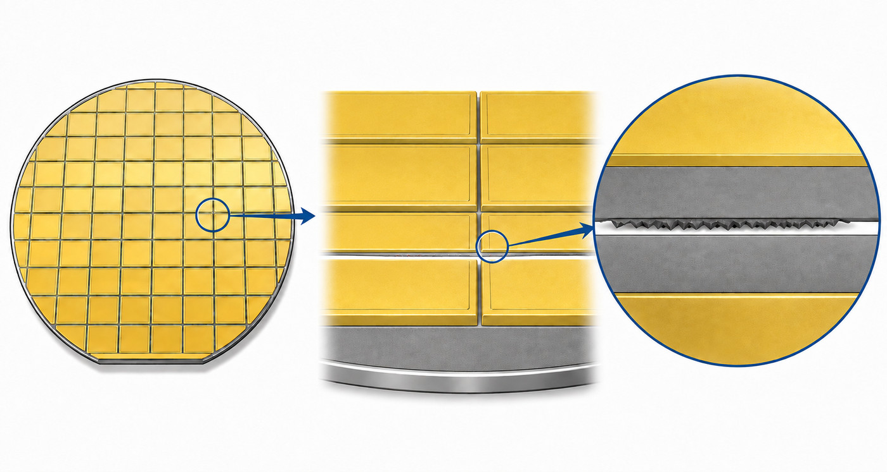

左からウェハ全体 → チップを区切るダイシングストリート → カーフ断面の拡大。
右端に見えるギザギザが、切断でアルミが引き伸ばされた跡です。

ウェハはダイシングテープに貼り、リングフレームに固定した状態で切ります。
断面の構成は上から **デバイス層（アルミ配線層）→ シリコン母材 → 接着層 → ダイシングテープ**。
テープまで切り込む**フルカット**で切ると、チップはテープ上に保持されたまま 1 個ずつに分かれ、
切り開かれた溝（**カーフ**）の側壁が、新しい「切断面」になります。

このとき、カーフの端部へ材料が引き伸ばされます。
最上層の**アルミ配線層**がブレードに引きずられ、
**薄い紙を巻いたような、渦巻き状の跡や突起**がカーフの端部に残ることがあります。

これが **AL カットバリ**です。

---

## 2. なぜ AL カットバリを検査するのか

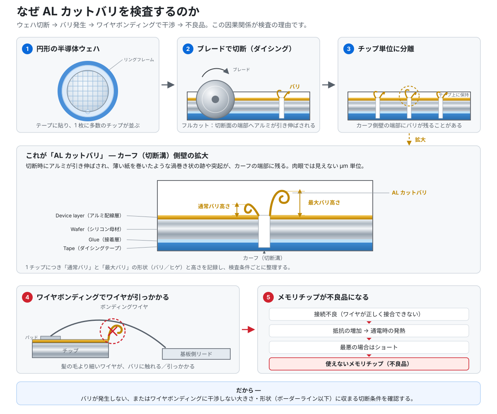

検査する理由は、次の因果関係にあります。

```text
ウェハ切断
  └→ AL カットバリが発生
       └→ ワイヤボンディング時に、細いワイヤがバリへ引っかかる／触れる
            └→ 接続不良・接続抵抗の増加・通電時の発熱
                 └→ 最悪の場合はショート
                      └→ メモリチップが使えない不良品になる
```

バリは肉眼では見えない μm 単位です。
一方、チップと基板をつなぐ**ボンディングワイヤは髪の毛よりも細く**、バリと同じスケールにあります。
だから「見えない突起」が、そのまま配線不良の原因になります。

つまりこの検査の目的は、バリを数えることではありません。

> **バリが発生しない、またはワイヤボンディングに干渉しない大きさ・形状で、
> ボーダーライン以下に収まる切断条件を確認すること。**

検査条件（切断条件）を振り分けたウェハを切り、条件ごとにバリの出方を比べる ―
そのための測定データを揃えるのが、この業務でした。

---

## 3. 実際の検査工程

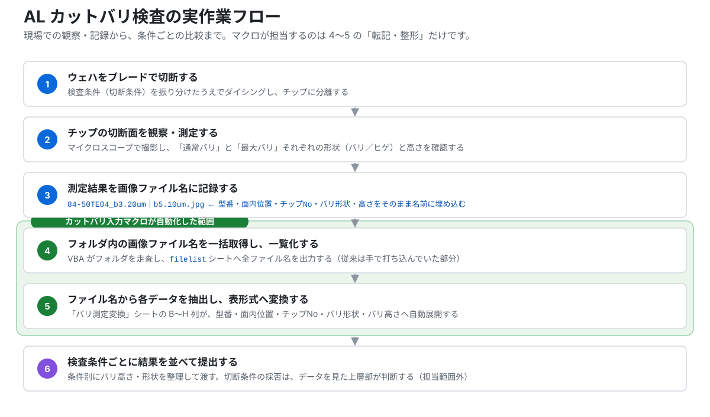

| 手順 | 作業 | 内容 |
|---|---|---|
| 1 | ウェハをブレードで切断 | 検査条件を振り分けたうえでダイシングし、チップに分離する |
| 2 | チップの切断面を観察・測定 | マイクロスコープで撮影し、**通常バリ**と**最大バリ**それぞれの形状・高さを確認する |
| 3 | 測定結果を画像ファイル名に記録 | 型番・面内位置・チップNo・バリ形状・バリ高さをファイル名に埋め込んで保存する |
| 4 | Excel で画像ファイル名を一覧化 | フォルダ内の全ファイル名を取得し、シートへ並べる |
| 5 | ファイル名から各データを抽出 | 型番・面内位置・チップNo・バリ形状・バリ高さを列に展開する |
| 6 | 検査条件ごとに結果を並べて提出 | 条件別にバリ高さ・形状を整理して渡す。どの切断条件を採るかの判断は、データを受け取った上層部が行う（担当範囲外） |

記録するのは 1 チップにつき次の 2 組です。

- **通常バリ** ― その切断面で代表的なバリ。形状（バリ／ヒゲ）と高さ
- **最大バリ** ― その切断面でいちばん大きいバリ。形状（バリ／ヒゲ）と高さ

「ヒゲ」は細く伸びた形状、「バリ」は巻き上がった形状の区分です。
ワイヤへの干渉しやすさは高さだけで決まらないため、**形状と高さをセットで**記録します。

---

## 4. 従来の問題点

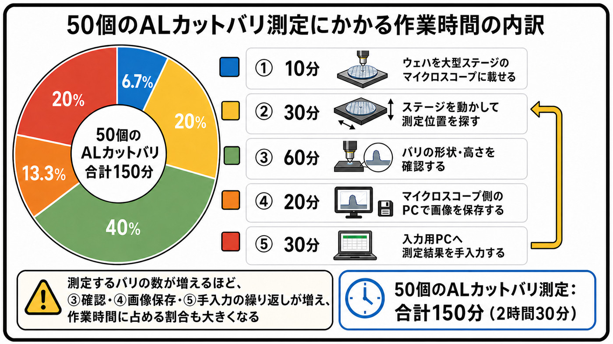

AL カットバリを 50 個測定したときの、作業時間の内訳です。

| 工程 | 時間 | 割合 |
|---|---|---|
| ① ウェハを大型ステージのマイクロスコープに載せる | 10 分 | 6.7% |
| ② ステージを動かして測定位置を探す | 30 分 | 20% |
| ③ バリの形状・高さを確認する | 60 分 | 40% |
| ④ マイクロスコープ側の PC で画像を保存する | 20 分 | 13.3% |
| ⑤ 入力用 PC へ測定結果を手入力する | 30 分 | 20% |
| **合計** | **150 分（2 時間 30 分）** | 100% |

測定するバリの数が増えるほど、③確認・④画像保存・⑤手入力の繰り返しが増え、
作業時間に占める割合も大きくなります。

> なお、これは**マクロ導入前**の内訳です。導入後は④で測定値をファイル名へ書き込むため、
> この工程は逆に少し長くなります（[§6 効果](#6-効果)）。

この内訳を踏まえると、カットバリ側で詰まっていた場所は、破断面観察側とは違いました。

- **入力ミスの確認作業が大きな問題だったわけではない。**
  カットバリ側は 1,000 行の台帳から該当行を探す作業ではなく、上から順に書き写す作業でした。
- **画像ごとに測定値と形状を転記する繰り返しに時間がかかっていた。**
  1 枚につき、通常バリ形状・通常バリ高さ・最大バリ形状・最大バリ高さの 4 項目。
- **型番・面内位置・チップNo も手作業で入力していた。**
  測定値と合わせると 1 枚あたり 7 項目になります。
- **件数が増えるほど、単純な入力・転記の負担がそのまま増えた。**
  50 枚撮れば 350 セル。100 枚なら 700 セル。作業量が件数に正比例していました。

課題は「間違いに気づけないこと」ではなく、
**同じ形の作業が、件数分そのまま積み上がること**でした。

そして測定値も形状も、**撮影した時点ですでにファイル名に書いてある**。
書いてある情報を、人が読んで、人がもう一度打ち直していた ― ここが無駄でした。

---

## 5. 対応策 ― カットバリ入力マクロ

### 5-1. ファイル名そのものを構造化データにする

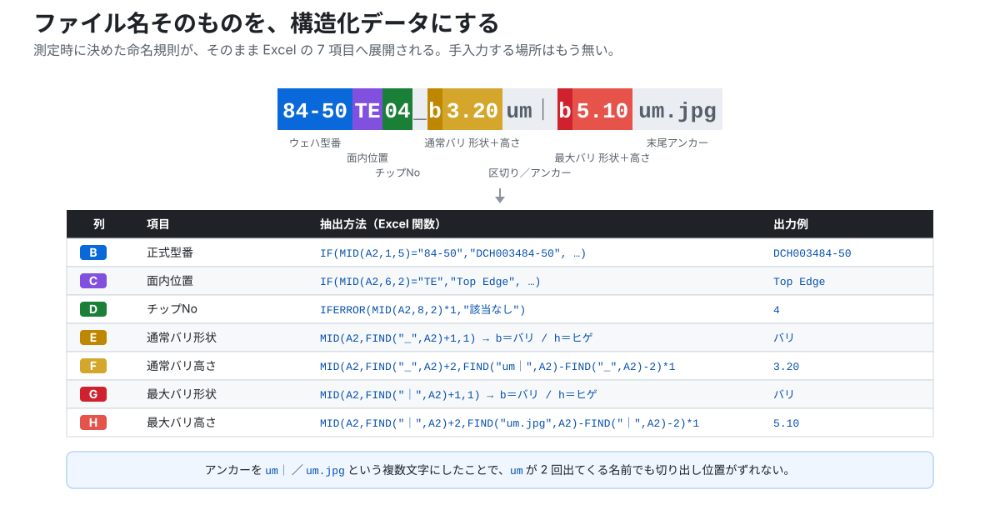

```text
84-50TE04_b3.20um｜b5.10um.jpg
```

| 区間 | 内容 | 例 | 変換後 |
|---|---|---|---|
| 1〜5 文字目 | ウェハ型番略称 | `84-50` | `DCH003484-50` |
| 6〜7 文字目 | 面内位置 | `TE` | Top Edge |
| 8〜9 文字目 | チップNo | `04` | 4 |
| `_` の直後 1 文字 | 通常バリ形状 | `b` | バリ（`h` ならヒゲ） |
| `_X` 〜 `um｜` の間 | 通常バリ高さ | `3.20` | 3.20 |
| `｜` の直後 1 文字 | 最大バリ形状 | `b` | バリ（`h` ならヒゲ） |
| `｜X` 〜 `um.jpg` の間 | 最大バリ高さ | `5.10` | 5.10 |


測定した人がファイル名を付けた時点で、後工程に必要なデータは全部そろっている。
**あとは機械に読ませればいい** ― これが設計の起点です。

#### 面内位置コードの取り決め

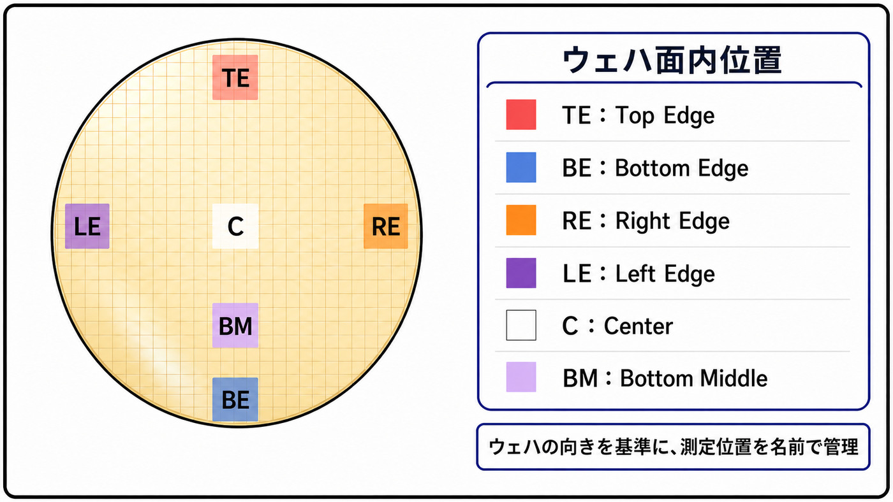

面内位置は、ウェハの向きを基準にした 2 文字コードで管理します。

| コード | 意味 |
|---|---|
| `TE` | Top Edge（上・外側） |
| `BE` | Bottom Edge（下・外側） |
| `RE` | Right Edge（右・外側） |
| `LE` | Left Edge（左・外側） |
| `BM` | Bottom Middle（下・中央） |
| `C` | Center（ど真ん中。範囲が狭いため 4 方向の区分なし） |

> **注記:** 上図は運用時の取り決めですが、リポジトリ内の `.xlsm` に入っている IF ネスト式は
> `TE` / `BM` / `Ct` / `LE` / `RE` の 5 種類で、`BE`（Bottom Edge）が未実装、
> Center のコードも `C` ではなく `Ct` になっています。

### 5-2. ワークブック構成（3 シート）

| シート名 | 役割 |
|---|---|
| `操作` | VBA ボタンの起点。フォルダ選択と、ファイル名の一括取得を実行する |
| `filelist` | VBA が取得したファイル名を A 列へ出力するバッファ |
| `バリ測定変換` | A 列にファイル名を貼ると、B〜H 列の関数が 7 項目へ自動展開する |

### 5-3. 操作手順（実質 2 ステップ）

| 手順 | 操作 | 結果 |
|---|---|---|
| ① | `操作` シートの **【選択するフォルダを決定】** を押す | フォルダ選択ダイアログが開き、選んだパスが `C5` に入る |
| ② | **【選択したフォルダからfilelistのシートにファイル名を張り出す】** を押す | `filelist` の A 列へ全ファイル名が出力され、取得件数がメッセージで返る |
| ③ | `filelist` の A 列をコピーし、`バリ測定変換` の A 列へ貼り付ける | B〜H 列が 7 項目へ自動展開される |

### 5-4. Excel 関数 ― 7 項目への自動展開

`バリ測定変換` シートの B〜H 列に入っている実際の式です。

```excel
' B列: 正式型番（1〜5 文字目を IF ネストで変換）
=IF(MID(A2,1,5)="80-50","DH26050758-50",
 IF(MID(A2,1,5)="84-12","CE26042384-12",
  IF(MID(A2,1,5)="84-50","DCH003484-50","該当なし")))

' C列: 面内位置（6〜7 文字目を IF ネストで変換）
=IF(MID(A2,6,2)="TE","Top Edge",
 IF(MID(A2,6,2)="BM","Bottom Middle",
  IF(MID(A2,6,2)="Ct","Center",
   IF(MID(A2,6,2)="LE","Left Edge",
    IF(MID(A2,6,2)="RE","Right Edge","該当なし")))))

' D列: チップNo（8〜9 文字目を数値化）
=IFERROR(MID(A2,8,2)*1,"該当なし")

' E列: 通常バリ形状（_ の直後 1 文字）
=IFERROR(IF(MID(A2,FIND("_",A2)+1,1)="h","ヒゲ",
         IF(MID(A2,FIND("_",A2)+1,1)="b","バリ","該当なし")),"該当なし")

' F列: 通常バリ高さ（_X 〜 um｜ の間）
=IFERROR(MID(A2,FIND("_",A2)+2,FIND("um｜",A2)-FIND("_",A2)-2)*1,"該当なし")

' G列: 最大バリ形状（｜ の直後 1 文字）
=IFERROR(IF(MID(A2,FIND("｜",A2)+1,1)="h","ヒゲ",
         IF(MID(A2,FIND("｜",A2)+1,1)="b","バリ","該当なし")),"該当なし")

' H列: 最大バリ高さ（｜X 〜 um.jpg の間）
=IFERROR(MID(A2,FIND("｜",A2)+2,FIND("um.jpg",A2)-FIND("｜",A2)-2)*1,"該当なし")
```

設計上のポイントは 3 つです。

- **アンカーを複数文字にした。**
  `um` は 1 つのファイル名に 2 回出てきます。単独の `um` を探すと切り出し位置がずれるため、
  中央側は `um｜`、最大側は `um.jpg` という**複数文字の組み合わせ**を目印にしました。
- **区切りに全角縦線 `｜` を選んだ。**
  当初は半角 `|` を検討しましたが、ファイル名として見たときに `l` や `1` と紛れます。
  全角縦線は視認性が高く、かつ測定値の中には絶対に出てこないため、一意な区切りとして機能します。
- **全列を `IFERROR` で包んだ。**
  想定外のファイル名が混ざっても `#VALUE!` を出さず `"該当なし"` を返します。
  条件付き書式でグレーに落とすことで、**「取れなかった行」が目で拾える**状態にしています。

### 5-6. 破断面観察版からの改良点

先に作った `破断面自動入力マクロ.xlsm` を土台にしていますが、そのままの流用ではありません。

| 箇所 | 破断面観察版 | カットバリ版 | 変えた理由 |
|---|---|---|---|
| 数値変換 | `MID(A2,8,2)*1` | `IFERROR(MID(A2,8,2)*1,"該当なし")` | 想定外のファイル名でシートがエラーだらけにならないように |
| 測定値抽出 | `IFERROR` なし | 全列 `IFERROR` | 同上。運用してみて必要だと分かった |
| アンカー | 単独の `um` | `um｜` / `um.jpg` | 測定値が 2 点に増え、`um` が 2 回出るようになったため |
| 測定項目 | 測定値 1 点 + 破断状態 | 通常／最大の 2 点 × 形状 + 高さ | 業務そのものが違うため |
| 転記方式 | 複合キー + `INDEX`/`MATCH` で台帳へ | 表として出力しそのまま比較 | カットバリ側は「行を探す」必要がなかったため |


---

## 6. 効果

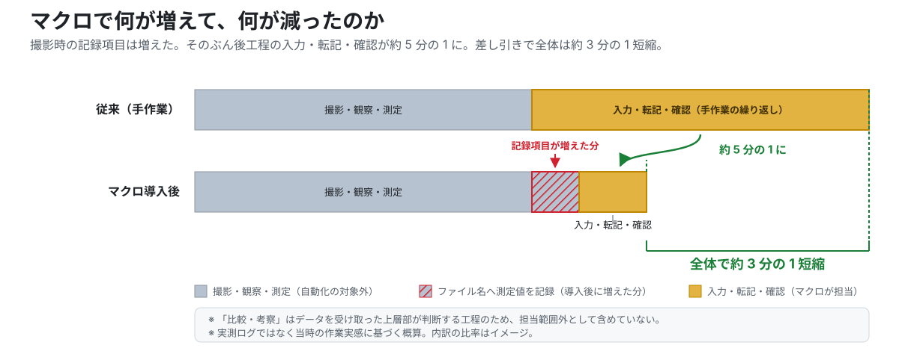

このマクロが何をして、何をしていないのかを、はっきり分けて書きます。

**自動化したこと**

- フォルダ内の画像ファイル名の一括取得
- `filelist` シートへの一覧出力
- ファイル名からの 7 項目（型番・面内位置・チップNo・通常バリ形状／高さ・最大バリ形状／高さ）の自動抽出
- バリ形状・高さの表形式への変換
- 手作業による繰り返し入力の削減

**していないこと（誤解されやすい点）**

- 確認作業をなくしたわけではない。抽出結果と「該当なし」表示の確認は今も必要です
- 入力ミスをゼロにしたわけでもない。命名を間違えれば、そのまま抽出結果が間違います
- **撮影・観察・測定は、むしろ少し長くなった。** 測定値をファイル名へ書き込むぶん、記録項目が増えたためです

**増えた分と減った分**

| 工程 | 変化 |
|---|---|
| 撮影・観察・測定 | 測定値をファイル名へ記録するぶん、**少し増えた** |
| 入力・転記・確認 | **約 5 分の 1** に |
| 差し引き（全体） | **約 3 分の 1 短縮** |

前工程で少し手間を増やし、そのぶん後工程の繰り返しをまとめて消す ― という交換です。
「撮影が速くなった」わけではありません。

**結果**

> 撮影時に記録項目が増えたぶんを差し引いても、
> **作業時間は約 3 分の 1（目安として 33〜35%）短縮**しました。

なお、この数字に**「比較・考察」は含まれていません。**
条件ごとの傾向をどう読み、どの切断条件を採るかは、データを受け取った上層部が判断する工程で、
私の担当範囲外です。数字を大きく見せるより、
**どこが増えてどこが減ったのか**を正確に書くほうが実態に合っています。

---

## 7. この記載で未確定の事項

公開にあたって、裏が取れていない点は書かずに残します。

| 項目 | 現状 | 本文での扱い |
|---|---|---|
| バリが影響する後工程の正式名称 | 「ワイヤボンディング」で通していたが、社内での正式な工程名は未確認 | 一般名称として「ワイヤボンディング」と記載 |
| 「AL 抵抗」という表現 | 現場で聞いた言い回しだが、一般的な用語として確認が取れていない | 使用せず「接続抵抗の増加」と記載 |
| ワイヤに干渉するボーダーラインの数値 | 具体値は未確認（かつ社外に出せる情報ではない） | 数値を書かず「ボーダーライン」とのみ記載 |
| 「約 5 分の 1」「約 3 分の 1」と §4 の内訳の対応 | §4 の内訳（50 個で 150 分）では ⑤手入力が 30 分・20%。一方で実感としては入力・転記・確認が約 5 分の 1 になり、全体では約 3 分の 1 短縮。両者は基準の取り方が異なるとみられ、突き合わせができていない | どちらも実際の数字としてそのまま併記し、換算はしない |
| 面内位置コードの正 | 図は `TE` / `BE` / `RE` / `LE` / `C` / `BM` の 6 種類。`.xlsm` の式は `TE` / `BM` / `Ct` / `LE` / `RE` の 5 種類で `BE` が未実装、Center が `Ct` | 両方を併記し、どちらが最新かは未確定と明記 |

数値を確定できるまでは、**幅と根拠を添えて書く**方針にしています。

---

<a id="part-2"></a>

# Part 2. 破断面観察 ― 3〜4 時間 → 約 45 分

> 使用するマクロ：[破断面自動入力マクロ.xlsm](破断面自動入力マクロ.xlsm)

こちらは**別の業務**です。同じ「ファイル名をデータソースにする」思想で作りましたが、
防いでいる不良も、詰まっていた場所も、効果の出方も違います。

## 目的

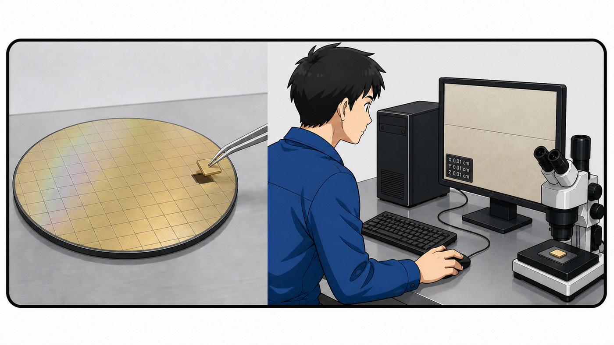

製造後のチップは、ロボットアームのエアピンセットでウェハから 1 枚ずつ取り出されます。
このとき**チップの強度が不足していると、取り出し時の圧力で割れて不良品になる**。

そこで、①ウェハ上のどの位置のチップが強度不足になりやすいか、②どの製造条件で強度が落ちるか、
を定量的に把握し、歩留まりを改善するのがこの観察の目的です。

## 従来の課題

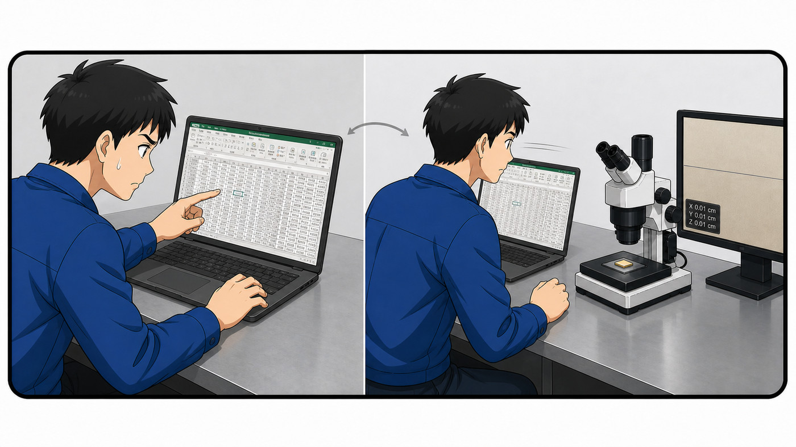

- 撮影 → 保存 → Excel 手入力 → Spotfire 集計 がすべて手作業
- 1,000 行超のシートから該当セルを**目視で探して**、1 件ずつ手入力
- 転記ミスが頻発し、修正に **3〜4 時間**かかることがあった
- Excel の入力ミスが Spotfire の集計にも波及し、やり直しが発生

### なぜ 3〜4 時間かかっていたのか

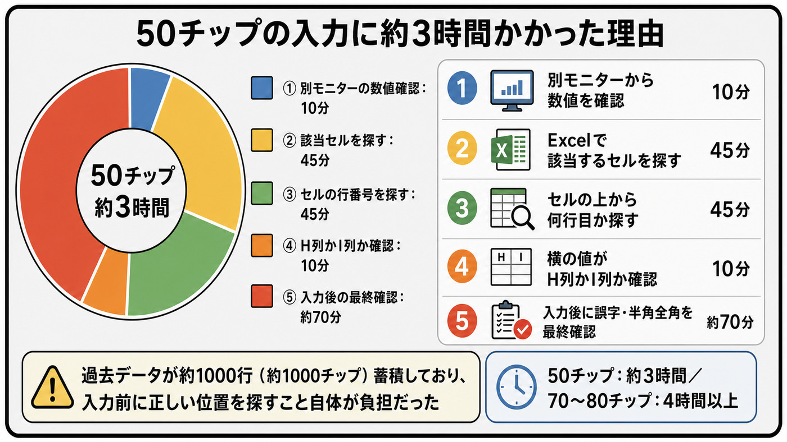

50 チップぶんを入力したときの内訳です。

| 工程 | 時間 |
|---|---|
| ① 別モニターから数値を確認 | 10 分 |
| ② Excel で該当するセルを探す | 45 分 |
| ③ セルの上から何行目か探す | 45 分 |
| ④ 横の値が H 列か I 列か確認 | 10 分 |
| ⑤ 入力後に誤字・半角全角を最終確認 | 約 70 分 |
| **合計** | **約 180 分（3 時間）** |

- 過去データが**約 1,000 行（約 1,000 チップ）**蓄積しており、入力前に正しい位置を探すこと自体が負担だった
- **50 チップで約 3 時間。70〜80 チップなら 4 時間以上**かかった

②③④を合わせた **100 分（全体の 56%）が「入力する場所を探す」時間**で、
数値を打ち込む作業そのものではありませんでした。

本質的な原因は**プロセスの設計そのもの**にありました。

1,000 行超のシートに数十件を手入力する作業は、構造的にミスが起きやすい。
行を目視で探しながら入力するため、**「どの行に入れるべきか」の確認コストが、入力そのものより大きかった**。
さらに入力後、50〜80 件の転記ミスがないかを再度目視確認する工程が必要で、
この**入力 → 確認 → 修正 → 再確認**のループが 1〜2 時間を占めていました。

> ミスが起きるのは作業者の問題ではなく、**「間違えても気づきにくい仕組み」だったこと**が根本原因。
> この認識が「確認しなくて済む構造を作る」という設計方針につながりました。

## ファイル命名規則

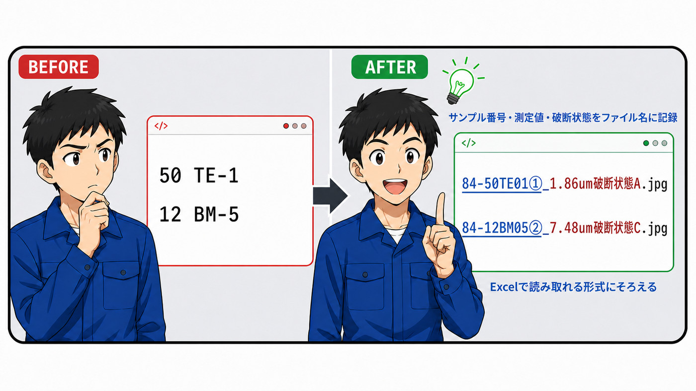

もともとのファイル名は `50 TE-1` `12 BM-5` のように、後から見ても何のデータか分からないものでした。
そこで**サンプル番号・測定値・破断状態をファイル名そのものに記録し、Excel で読み取れる形式にそろえる**ことにしました。

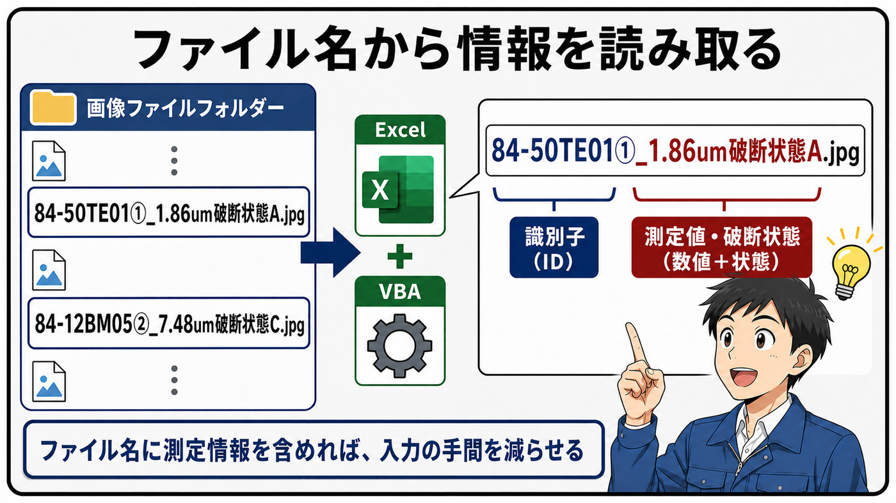

ファイル名は「**識別子（ID）**」と「**測定値・破断状態（数値＋状態）**」の 2 ブロックでできています。
ファイル名に測定情報を含めておけば、Excel と VBA でそのまま読み取れて、入力の手間を減らせます。

```text
例: 84-50TE04①_X.XXum破断状態A.jpg
```

| 位置 | 内容 | 抽出例 | 変換後 |
|---|---|---|---|
| 1〜5 文字目 | ウェハ型番（略称） | `84-50` | `DCH003484-50` |
| 6〜7 文字目 | ウェハ上の取得位置 | `TE` | Top Edge |
| 8〜9 文字目 | サンプル番号 | `04` | 4 |
| 10 文字目 | 破断方向（3 パターン） | `①` | ① |
| `_` 〜 `um` の間 | 測定値（破断時の圧力） | `X.XX` | 数値 |
| `um` 〜 `.jpg` の間 | 破断状態 | `破断状態A` | 破断起点の分類 |

## ワークブック構成（4 シート）

| シート名 | 役割 |
|---|---|
| `操作` | VBA ボタンの起点。フォルダ選択・ファイル名取得を実行 |
| `filelist` | 取得したファイル名を A 列へ出力するバッファ |
| `貼り付け場所変換` | B〜G 列で各フィールドを抽出し、H 列に複合キーを生成 |
| `まとめDB` | 全組み合わせマスタ。E・F 列が `INDEX`/`MATCH` で値を自動取得 |

VBA は カットバリ版と同じ 2 ステップ（フォルダ選択 → `filelist` へ出力）です。

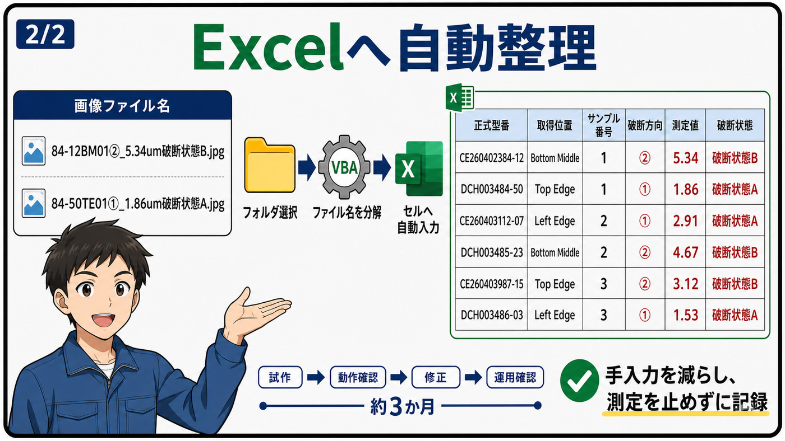

フォルダを選ぶと、VBA がファイル名を分解して、正式型番・取得位置・サンプル番号・破断方向・測定値・破断状態を
そのままセルへ流し込みます。

> **開発期間:** 試作 → 動作確認 → 修正 → 運用確認 で **約 3 か月**。
> 業務を止めずに、空き時間で少しずつ作って現場で試す進め方でした。

## 主要な関数

```excel
' 破断方向（10 文字目）― IF + IFERROR + FIND による堅牢な判定
=IF(IFERROR(FIND("①",A2),0)
   +IFERROR(FIND("②",A2),0)
   +IFERROR(FIND("③",A2),0)=0,
  "該当なし",
  MID(A2,
    IFERROR(FIND("①",A2),0)
   +IFERROR(FIND("②",A2),0)
   +IFERROR(FIND("③",A2),0),1))

' 測定値（_ と um の間）
=MID(A2, FIND("_", A2) + 1, FIND("um", A2) - FIND("_", A2) - 1) * 1

' 破断状態（um 〜 .jpg の間）
=MID(A2, FIND("um", A2) + 2, FIND(".jpg", A2) - FIND("um", A2) - 2)

' 複合キー（H 列）
=B2&C2&D2&E2

' まとめDB E列: 測定値の自動転記
=IFERROR(INDEX(貼り付け場所変換!F:F, MATCH(A2&B2&C2&D2, 貼り付け場所変換!H:H, 0)), "該当なし")
```

`MID` で固定位置から取る方法では、ファイル名に想定外の文字が混ざるとエラーになります。
`FIND` で**存在位置を検索し、見つからなければ 0**を返す方式に切り替えたことで、抽出エラーを大きく減らせました。

## まとめDB の設計

`まとめDB` は、すべてのサンプルの識別情報をあらかじめ網羅した**全組み合わせマスタ**です。

```text
3 型番 × 5 取得位置 × 3 破断方向 × 10 サンプル番号 = 450 行
```

- 実務の管理台帳は 1,000 行超。本リポジトリの公開用ファイルは、上記 450 行構成のサンプルです
- 並び順は 型番 → 取得位置 → 破断方向 → No。Spotfire でフィルタしやすい構造にしています
- E 列または F 列が「該当なし」の行はグレー（`#BFBFBF`）で塗りつぶし。
  未撮影・未処理が一目で分かり、データが入ると自動で解除されます

> 従来は 1,000 行超から目視で行を探して手入力していましたが、
> まとめDB では全行があらかじめ存在するため「行を探す」作業自体が消えます。

## 改善前と改善後のワークフロー

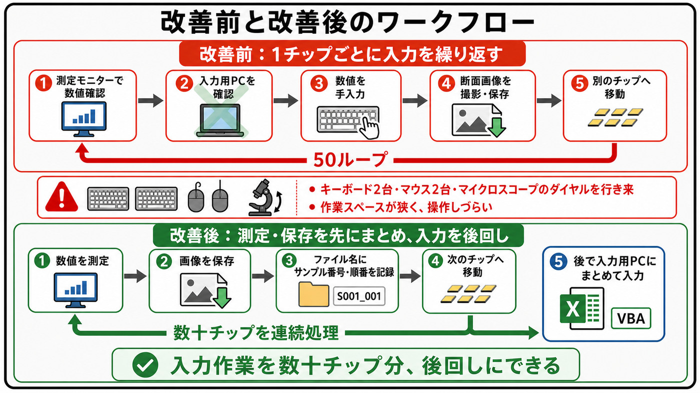

**改善前 ― 1 チップごとに入力を繰り返す**

`① 測定モニターで数値確認 → ② 入力用 PC を確認 → ③ 数値を手入力 → ④ 断面画像を撮影・保存 → ⑤ 別のチップへ移動`
これを **50 回ループ**します。

- キーボード 2 台・マウス 2 台・マイクロスコープのダイヤルを行き来する必要があった
- 作業スペースが狭く、そもそも操作しづらい

測定と入力が 1 チップごとに交互に挟まるため、**測定の流れが毎回途切れる**のが一番の問題でした。

**改善後 ― 測定・保存を先にまとめ、入力を後回しにする**

`① 数値を測定 → ② 画像を保存 → ③ ファイル名にサンプル番号・順番を記録 → ④ 次のチップへ移動`
ここまでを**数十チップぶん連続で処理**し、`⑤ 後で入力用 PC にまとめて入力`（Excel + VBA）に回します。

> ファイル名に情報を持たせたことで、**入力作業を数十チップ分まとめて後回しにできる**ようになりました。
> 手を止めずに測定を続けられることが、時間短縮そのものと同じくらい効いています。

---

## 成果

| 指標 | 改善前 | 改善後 |
|---|---|---|
| データ入力時間 | 3〜4 時間（ミス修正・再確認含む） | **約 45 分** |
| 転記ミス | 高頻度（50〜80 件の見直しが必要なことも） | 大幅に低減（確認自体は継続） |
| Spotfire 再集計 | 頻繁 | 大幅に減少 |
| ミス確認作業 | 入力後に 1〜2 時間かけて目視確認 | 抽出結果と「該当なし」表示の確認が中心 |

この改善を社内の業務報告で発表したところ、報告の中で**最も高い評価**をいただきました。

---

# 共通の設計思想

2 つの業務を通して、やっていることは同じです。

1. **ファイル名を構造化データのソースにする。**
   保存時の命名という**上流の小さな設計変更**が、下流の全工程に効きます。
   ソフトウェア設計でいうデータモデリングの考え方そのものでした。
2. **略号を、意味のある名前へ変換する。**
   `TE` を `Top Edge` に、`b` を `バリ` に。人が読む名前と機械が読む記号を分けます。
3. **`FIND` + `MID` + `IFERROR` で堅牢にパースする。**
   「N 文字目を取る」ではなく「目印を探して切り出す」。想定外の入力で止まらない構造にします。
4. **取れなかったことを、目で分かる形で残す。**
   エラーではなく `"該当なし"` を返し、条件付き書式で色を落とす。
   自動化は「気づけなくなる」方向に働きやすいので、ここは意識的に設計しました。

---

## リポジトリ構成

```text
転職用GITHUB/
├── README.md                        # 本ドキュメント
├── background.md                    # 業務背景（2 業務の目的と流れ）
├── excel_formulas.md                # Excel 関数の設計詳細
├── index.html / style.css           # 採用担当者向けの 1 ページ LP
├── カットバリ自動入力マクロ.xlsm    # AL カットバリ確認用（3 シート + VBA + 関数）
├── 破断面自動入力マクロ.xlsm        # 破断面観察用（4 シート + VBA + 関数）
├── カットバリdummy_data/            # 動作確認用ダミー画像（50 件）
├── 破断面dummy_data/                # 動作確認用ダミー画像（20 件）
└── Python VBA/
    ├── extract_from_filenames.py    # Python 版ファイル名解析スクリプト
    ├── output.csv                   # 出力結果
    └── program_overview.md          # 処理概要
```

ダミー画像は公開用に生成したもので、実製品の画像・実測値は含みません。

## 技術スタック

- **Excel VBA** — フォルダ選択・ファイル名一括取得の 2 ステップマクロ（Windows / Mac 両対応）
- **Excel 関数（パース）** — `IF`（ネスト）, `MID`, `FIND`, `IFERROR` でファイル名から全フィールドを抽出
- **Excel 関数（転記）** — `INDEX` + `MATCH` の複合キー照合で台帳への手入力を排除
- **TIBCO Spotfire (DXP)** — データ集計・可視化

## GitHub 連動型ポートフォリオ LP

採用担当者向けに概要を短時間で伝える 1 ページ HTML も同梱しています。

| ファイル | 役割 |
|---|---|
| `index.html` | LP 本体。改善前の工程、時間がかかった理由、改善後の工程、Before / After、GitHub 導線 |
| `style.css` | LP の見た目とスマホ対応 |
| `README.md` | 技術詳細・運用手順の裏付け |

LP は「第一印象」、GitHub と README は「裏付け」として役割を分けています。

```bash
open index.html
```

**GitHub Pages で公開する場合:** `Settings` → `Pages` → `Source` を `Deploy from a branch` にし、
`Branch` を `main`、フォルダを `/root` に設定して保存します。

---

## キャリアの経緯と転職の動機

### 大学での学び → 技術派遣へ

大学時代はソフトウェアを中心に、**プログラミングや AI の分野を専攻**していました。
ただ入社当時は実務的な資格を持っておらず、AI もまだ現在ほど注目されていなかったため、
技術派遣では**製造業、いわゆるハードウェア**を中心にキャリアを積むことになりました。

### 製造現場での苦戦

半導体メモリの製造会社での派遣では、正直に言えば**手作業の精度**で苦戦しました。

- マイクロスコープでの細かなサンプル操作に慣れず、**誤ってサンプルをダメにしてしまう**ことがあった
- データ入力のミスにより、**Spotfire の発表スライドを作り直す**事態が発生した
- 繊細な手作業の連続は、自分にとって得意な領域ではなかった

### 業務効率化での成功体験

一方で、その手作業のミスを**仕組みで解決する**取り組みでは、まったく違う結果が出ました。

**誰にも頼まれていないにもかかわらず**、自発的にファイル命名規則の設計と Excel 関数・VBA による
自動化に取り組み、3〜4 時間の作業を 45 分に短縮。業務報告で発表したところ、
**どの業務報告よりも受けが良かった**という成功体験を得ました。

### プログラマーへの転職を決意した理由

この対比が、自分の適性を明確にしてくれました。

**手を動かす繰り返し作業**では目立つミスがあった一方で、
**「どうすればミスが起きない仕組みを作れるか」を考えて実装する**領域では、
自発的に動き、成果を出し、高い評価を得ることができた。

大学で学んだプログラミングと AI の知識がこの現場で初めて活き、
Excel 関数と VBA という限られたツールでも目に見える改善を生み出せた。
ならば、**本格的なプログラミング言語を使えばもっと大きな課題を解決できる**はず。

大学での学びの土台、現場で手を動かして成果を出した実感、
そして自分が本当に力を発揮できる領域が明確になったこと。
この 3 つが重なったことが、ソフトウェア開発を本業にしたいという決意の原点です。
